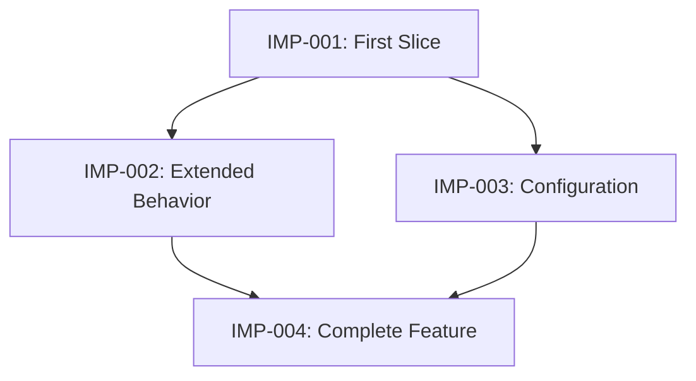

# Implementation Plan

## Purpose

Convert the approved requirements and architecture into small, ordered, and verifiable implementation issues that an agent can execute with limited additional context.

## Main Question

> In what small, verifiable increments should the mod be built?

## Required Input

- `workspace/documentation/requirements.md`
- `workspace/documentation/architecture.md`
- The approved repository baseline identified by the active workflow
- The active project under `workspace/project/<project_directory_name>/`
- The active workflow's `<artifact-root>`

## Objectives

Establish:

- The implementation strategy
- Thin vertical slices of working behavior
- Dependencies and blocking relationships
- The order in which issues should be completed
- Which requirements each issue satisfies
- Which architectural components each issue affects
- How each issue will be verified
- Which validation environment tier each check uses, what it proves, and what it does not prove
- Whether each owner-performed manual validation is scheduled now, deferred, or waived
- What authoritative state or event each manual runtime check must observe, and how it will be observed
- Which technical risks should be addressed early
- What constitutes completion for each issue
- Which optional requirements are deferred

## In Scope

- Breaking requirements into implementation issues
- Organizing work into vertical slices
- Identifying necessary foundational work
- Defining issue dependencies
- Creating an acyclic dependency graph
- Prioritizing risky or uncertain work
- Defining acceptance criteria for each issue
- Defining verification procedures
- Defining a risk-based validation environment plan
- Consolidating owner-performed manual validation decisions before implementation
- Designing the minimum observability needed for reliable manual runtime verification
- Linking issues to requirements and architecture
- Identifying likely code areas affected
- Establishing issue statuses and workflow
- Establishing a Definition of Done

## Out of Scope

Do not attempt to:

- Write production code
- Implement tests
- Redesign approved requirements or architecture
- Add unapproved features
- Resolve implementation discoveries that have not occurred
- Specify every method-level coding action
- Create release documentation or assets
- Plan maintenance after release
- Produce arbitrary time estimates or deadlines

If planning reveals a defect in the requirements or architecture, return the issue to the appropriate stage instead of silently compensating for it in the plan.

## Desired AI Behavior

Act as an implementation planner.

- Derive implementation issues from the approved requirements and architecture.
- Prefer small vertical slices that produce integrated, observable behavior.
- Create the smallest useful end-to-end slice early.
- Avoid organizing the entire plan into horizontal technical layers.
- Allow foundational issues only when they genuinely unblock vertical slices.
- Keep foundational work as small and specific as possible.
- Give every issue a clear objective and completion boundary.
- Make dependencies explicit.
- Ensure the dependency graph contains no cycles.
- Schedule high-risk assumptions and implementation validations early.
- Define verification before implementation begins.
- For every manual runtime check, identify the authoritative state or event being tested and whether normal behavior exposes it reliably.
- Assign every runtime check to the lowest validation tier that supplies meaningful evidence, and state any important limitation of that tier.
- When normal behavior is insufficient, include the minimum diagnostic mechanism in the same vertical slice or add an explicit prerequisite issue that delivers it first.
- Prefer same-issue diagnostics; use a prerequisite when the mechanism is shared by multiple slices or substantial enough to require separate implementation and review.
- Do not add diagnostics mechanically when stable external behavior already proves the result.
- Make noisy or player-visible diagnostics disabled by default unless normal product behavior requires otherwise, and apply approved authorization boundaries to administrative state-changing commands.
- Select verification appropriate to the behavior instead of requiring strict TDD.
- Use automated tests for isolated logic where practical.
- Use Minecraft client, dedicated-server, multiplayer, compatibility, or performance verification where required.
- Do not require every environment mechanically. Use code paths and project risks to decide whether a representative non-Overworld check, dedicated server, packaged environment, modpack, or multiplayer check is necessary.
- Ensure each issue is understandable to an agent starting with a fresh context.
- Avoid repeating entire project documents inside every issue.
- Reference requirements and architectural decisions by stable identifiers.
- Avoid speculative tasks for hypothetical future needs.
- Use focused questions for branching prioritization or scope decisions and compact decision packets for related plan defaults or issue-grouping choices.
- Do not ask questions already answered by approved documents.
- Identify contradictions or missing information rather than guessing.
- Generate complete draft artifacts, present them for approval, and revise them as required.

## Vertical Slices

A vertical slice should implement a small piece of behavior across every necessary part of the system.

For example, a slice might include:

- Relevant configuration
- Core behavior
- Loader integration
- Client/server handling
- Persistence or networking
- Verification
- Any diagnostic support required to make that verification reliable

A vertical slice should produce something observable and verifiable, even if the feature is not yet complete.

Do not split work entirely into layers such as:

1. Create every data class.
2. Create every loader event handler.
3. Create every network message.
4. Connect everything at the end.

Some horizontal or foundational work may still be necessary, including:

- Shared registration infrastructure
- Test infrastructure
- Required dependency setup

Such work must have a concrete consumer and must not become speculative framework construction.

## Issue Size

An issue should:

- Have one coherent objective.
- Produce an observable result or unblock a specific slice.
- Be small enough for a focused implementation session.
- Be independently reviewable.
- Have explicit acceptance criteria.
- Have a defined verification procedure.
- Include or depend on the observability required by any manual verification procedure.
- Avoid combining unrelated requirements.

If an issue has multiple unrelated outcomes or an extensive verification procedure, split it.

## Issue Statuses

Use these statuses:

- **Backlog:** Identified but not ready to implement.
- **Ready:** Fully defined and all blockers are resolved.
- **In Progress:** Currently being implemented.
- **Review:** Implementation is complete and awaiting independent review.
- **Blocked:** Cannot proceed because a dependency or decision is unresolved.
- **Done:** Acceptance criteria, verification, and review are complete.
- **Deferred:** Intentionally excluded from the current release.

Only issues with the **Ready** status should be given to an implementation agent.

## Issue Format

Use stable identifiers such as `IMP-001`.

Each issue should follow this structure:

```markdown
# IMP-001: Short Issue Name

**Status:** Ready  
**Type:** Vertical Slice  
**Priority:** High  
**Blocked By:** None

## Objective

Describe the single outcome this issue must produce.

## Requirements

- REQ-001
- REQ-002

## Architecture References

- Relevant component
- ARC-001

## Expected Outcome

Describe the observable behavior available after completion.

## In Scope

- Work included in this issue

## Out of Scope

- Related work intentionally excluded from this issue

## Implementation Constraints

- Approved architectural boundaries
- Required libraries or integration points
- Client/server restrictions
- Relevant project defaults

## Likely Code Areas

- Packages, components, or resources likely to change

## Acceptance Criteria

- Given ..., when ..., then ...
- Given ..., when ..., then ...

## Verification

- Automated checks where practical
- Development-client checks
- Dedicated-server checks
- Multiplayer, compatibility, or performance checks when relevant

## Manual Observability

- Authoritative state or event that a manual check must observe
- Whether stable normal behavior exposes it reliably
- Required logs, inspect commands, controlled-state commands, counters, or other narrow diagnostics when normal behavior is insufficient
- Same-issue implementation or explicit prerequisite issue
- Default enabled/disabled state and relevant authorization boundary

## Completion Evidence

Record the tests, commands, observations, logs, or measurements demonstrating completion.
```

Omit **Manual Observability** when the issue has no manual runtime verification. When it applies, complete the section before marking the issue Ready; do not leave the observation path to be invented during Implementation.

Use `Type: Foundation` only when an issue does not directly deliver observable mod behavior but is necessary to unblock identified vertical slices.

## Dependency Graph

Represent blocking relationships as a directed acyclic graph.

An issue may begin only when all issues listed under `Blocked By` are complete.

Use a compact Mermaid diagram when it makes the dependencies easier to understand:



The graph describes dependency order, not necessarily a strict sequence. Issues without dependencies may be implemented independently.

## Definition of Done

An implementation issue is Done only when:

- Its implementation is complete.
- Its acceptance criteria are satisfied.
- Required automated checks pass.
- Required in-game verification is complete.
- Client and dedicated-server behavior have been checked when relevant.
- No unrelated requirements were introduced.
- The implementation follows the approved architecture.
- Relevant defects have been resolved or explicitly recorded.
- An independent review has been completed.
- Completion evidence has been recorded.
- The issue status has been changed to **Done**.

## Verification Environment Plan

Use these evidence tiers consistently:

1. **Automated or static:** compilation, unit tests, static inspection, or artifact inspection.
2. **Development client:** `runClient`, including its integrated server when applicable.
3. **Development dedicated server:** `runServer`.
4. **Packaged clean environment:** the built jar in a clean Forge client or dedicated server.
5. **Target modpack or alternate runtime:** the built jar in the intended pack, including Cleanroom when selected.
6. **External multiplayer:** a separately operated multiplayer environment.

Higher numbers are not automatically better or mandatory. Select tiers from the behavior and risk. For every planned check, record the tier, the evidence it supplies, and important evidence it cannot supply.

Dimension coverage is also risk-based. When behavior is dimension-agnostic, source inspection plus one representative non-Overworld runtime check is normally sufficient. Require broader dimension coverage only when the code, dependency, configuration, or reported defect is dimension-specific.

Before Implementation begins, present one compact decision packet for owner-performed manual checks. Record each as:

- **Test now:** required before the affected issue can be Done.
- **Defer:** postponed to a named later checkpoint.
- **Waive:** accepted as unperformed for this workflow, with the evidence limitation recorded.

Do not repeatedly ask about a deferred or waived check unless new evidence materially changes its risk.

## Process

1. Read all required input documents.
2. Extract requirements, architectural components, and implementation risks.
3. Identify the smallest useful end-to-end behavior.
4. Define the first vertical slice.
5. Divide remaining behavior into additional vertical slices.
6. Add only the foundational issues required by identified slices.
7. Link every issue to requirements and architecture.
8. Define acceptance criteria and verification for every issue.
9. Assign each verification check to an environment tier and state what that evidence proves and does not prove.
10. For every manual runtime check, define its observability contract and add any required same-issue diagnostic work or prerequisite issue.
11. Present one decision packet for owner-performed manual validation and record each check as Test now, Defer, or Waive.
12. Identify dependencies and blockers, including diagnostic prerequisites that must be Done before dependent manual verification begins.
13. Construct the dependency graph.
14. Check the graph for cycles.
15. Schedule risky assumptions and validation work early.
16. Confirm that every required behavior is covered.
17. Identify optional requirements that will be deferred.
18. Generate the implementation-plan artifacts as complete drafts.
19. Present the drafts for review and revise them until explicitly approved.

## Output Artifacts

### `<artifact-root>/implementation-plan.md`

Produce the plan from `setup/artifact-templates/implementation-plan.md`. The template is the authoritative plan structure. The issue format defined by this stage and reproduced in that template is authoritative for issue files.

### `<artifact-root>/issues/`

Create one Markdown file for each implementation issue:

```text
issues/
├── IMP-001-short-name.md
├── IMP-002-short-name.md
└── IMP-003-short-name.md
```

The implementation plan should reference these files instead of duplicating their full contents.

## Completion Criteria

This stage is complete when:

- Every MUST requirement is covered by at least one issue.
- Every SHOULD and MAY requirement is scheduled or explicitly deferred.
- Issues are organized primarily as vertical slices.
- Necessary foundational work has a specific identified consumer.
- Every issue has an objective, scope, acceptance criteria, and verification procedure.
- Every verification check identifies its environment tier, evidentiary value, and material limitation.
- Owner-performed manual checks have one recorded Test now, Defer, or Waive decision.
- Every manual runtime verification procedure identifies what authoritative state or event it observes and has the necessary diagnostic support in the same issue or an explicit completed prerequisite.
- Every issue references relevant requirements and architecture.
- All blocking relationships are explicit.
- The dependency graph is acyclic.
- High-risk implementation validations are scheduled early.
- The first slice produces integrated and observable behavior.
- Each Ready issue can be understood by an agent with fresh context.
- The Definition of Done is established.
- The project owner explicitly approves the plan.
- `<artifact-root>/implementation-plan.md` and the issue files have been generated and explicitly approved.

Completion does not require writing implementation code.

The plan is an approved baseline, but it may be updated when implementation produces new evidence. Any change affecting requirements or architecture must return to the appropriate earlier stage.
